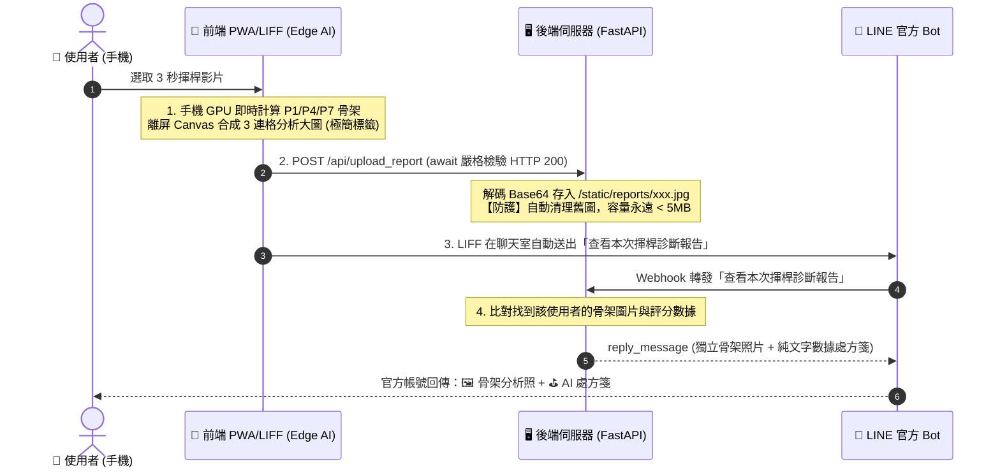

# 🏌️ GOLF SWING AI - 開發歷程與對話決策紀錄 (DEV_LOG)

> **建立時間**：2026-09-05  
> **專案名稱**：Golf Swing AI Assistant (高爾夫智慧揮桿分析助理)  
> **技術架構**：純前端邊緣運算 (Edge AI PWA / LIFF) + 極輕量 FastAPI LINE Bot

---

## 📌 1. 核心專案設定與端點

| 項目 | 設定值 / 網址 | 說明 |
| :--- | :--- | :--- |
| **LIFF ID** | `2011445978-6xeS4R70` | 綁定至 LINE Developers LIFF 應用程式 |
| **前端 PWA 網址** | `https://leonhi1025.github.io/Golf-Assistant/static/index.html` | 託管於 GitHub Pages，支援手機 GPU 本地運算 |
| **後端 Webhook 網址**| `https://golf-assistant.onrender.com` | 託管於 Render (FastAPI)，負責 Webhook 與圖片轉發 |
| **GitHub 倉庫** | `https://github.com/LeonHi1025/Golf-Assistant` | `main` 分支 |

---

## 🏛️ 2. 系統架構與關鍵決策

### 核心技術特點：
1. **0% 伺服器 AI 負載**：
   - 影片解碼、MediaPipe 姿態估計、角度計算 100% 在使用者手機 GPU（WebGL/Wasm）上運算。
   - 伺服器記憶體佔用僅約 **35 MB**，不耗費伺服器 CPU。
2. **100% 免費回覆機制 (Zero Push Quota)**：
   - 官方帳號使用 `reply_message`（搭配 `reply_token`）發送，完全不計入 LINE 官方每月 200 則的 Push 訊息上限。
3. **自動磁碟垃圾回收防護 (Disk Safeguard)**：
   - 伺服器常態只保留最新 30 張分析截圖，超過 40 張自動刪除舊檔，硬碟空間永遠鎖定在 **5 MB 以內**。
4. **手機端快取破壞策略 (Cache Busting)**：
   - 引入 `app.js?v=20260905_4` 與 Service Worker `golf-pwa-v2`，確保手機 LINE 內嵌瀏覽器隨時載入最新程式碼。
5. **定時喚醒與防休眠 (Keep-Alive CronJob)**：
   - 設定 CronJob 每 10 分鐘自動發送 HTTP Ping (Tick)，防止 Render 免費實例因無訪問進入休眠，保持 24/7 隨時熱機即時回覆。

---

## 📝 3. 開發歷程與迭代紀錄

### 🔄 第一階段：架構轉型（從伺服器端重負載 ➔ 純前端 Edge AI）
- **痛點**：原本在伺服器端運行 OpenCV + MediaPipe，導致 Render/Zeabur 伺服器記憶體容易暴增（超過 512MB 限制）。
- **解法**：重構為純前端 PWA/LIFF 架構，引入 `@mediapipe/tasks-vision`，改由手機硬體晶片即時運算，後端轉型為輕量 Webhook 轉發器。

### 🔄 第二階段：報告自動化與訊息簡化
- **使用者需求**：
  1. 使用者在聊天室只發送乾淨純文字：`查看本次揮桿診斷報告`（不帶複雜參數）。
  2. 官方 Bot 自動回傳標記有骨架的分析照片。
- **解法**：
  - 前端 Canvas 合成 P1（準備）、P4（上桿頂點）、P7（擊球瞬間）3 格橫幅照片。
  - 前端使用 `await` 嚴格確保圖片上傳伺服器並獲得 `HTTP 200 OK` 後，才透過 `liff.sendMessages` 送出指令。
  - 後端 Webhook 接收到關鍵字後，同時回覆 `ImageMessage` 與 `FlexMessage`。

### 🔄 第三階段：視覺美化與版面純淨化
- **使用者需求**：
  1. 照片發送一次即可，不與處方箋卡片重複嵌入。
  2. 照片僅標註 P1、P4、P7，其餘文字與數據移至下方文字卡片，保持照片整潔。
  3. 卡片風格改為**白底黑字、深灰按鈕**，文字調整為「⛳ 動作評定」與「💡 本次建議」。
- **解法**：
  - `app.js`：簡化 3 連格截圖，移除大標題與底部橫幅，僅保留左上方半透明膠囊標籤 (`P1 準備站姿` / `P4 上桿頂點` / `P7 擊球瞬間`)。
  - `main.py`：處方箋卡片採用 `#FFFFFF` 白底、`#111111` 黑字與 `#2D3748` 深灰按鈕；新增 `/favicon.ico` 路由消除 404 報錯。

### 🔄 第四階段：自訂對話關鍵字與伺服器喚醒機制
- **使用者需求**：
  1. 輸入 `Hi! Wake up!` ➔ 伺服器已啟動時回覆：`Hi! 現在可以點Let’s Analyze來嘗試功能！`
  2. 輸入 `Amba` ➔ 彩蛋回覆：`oh..Shit...`
  3. 輸入 `查看本次揮桿診斷報告` ➔ 回傳骨架截圖與處方箋。
  4. 其餘輸入 ➔ 統一回覆：`可以嘗試Let’s Analyze進行高爾夫球姿勢影片分析哦`
- **解法**：
  - 在 `main.py` 的 `handle_text` 實作多分支條件邏輯與正規化處理。

### 🔄 第五階段：網頁白灰高雅色系、動態大灰球背景與文案微調
- **使用者需求**：
  1. 網頁文本修改：
     - 副標題：`影片自動擷取 P1 / P4 / P7 骨架與評分`
     - 提示語：`Tips:影片於6秒者為佳`
  2. 網頁色彩與動態調整：
     - 背景採用高雅**白偏灰質感底色**（`#F4F5F7`），搭配現代純白磨砂卡片（`rgba(255, 255, 255, 0.95)`）與深色對比文字/按鈕（`#09090B`）。
     - 背景動態粒子升級：**球球變大**（半徑 3.5px ~ 9px）、**運動速度加快**（`v = 1.8x`）、**密度減半**更加簡約耐看，並帶有細膩的灰調微光動態連線特效。
     - 上傳區域圖示替換為極簡幾何 **SVG 上傳符號**，視覺風格更俐落統一。
- **解法**：
  - 更新 `static/index.html` 樣式、Meta 標籤與 Canvas 動畫繪製邏輯。
  - 更新腳本引用版本號避免快取。

### 🔄 第六階段：定時喚醒機制 (CronJob Keep-Alive)
- **維運設定**：
  - 設定 CronJob 每 10 分鐘（`*/10 * * * *`）自動發送請求（Tick / Ping）至後端伺服器（`https://golf-assistant.onrender.com/api/config`）。
  - **目的**：防止 Render 免費方案在閒置 15 分鐘後自動進入休眠（Spin-down），確保官方 LINE Bot 與 Webhook 24 小時保持熱機狀態，提供秒級即時回應。

### 🔄 第七階段：Tiger Woods 職業標準十階段 (P1~P10) 與「3+4+3」分組精準動力學架構升級
- **使用者需求**：
  1. 升級為完整 P1 ~ P10 十大相位分析。
  2. 排版分組嚴格採用 **「3 + 4 + 3」** 架構：
     - **（上揚組）**：P1 (準備站姿) + P2 (起桿水平) + P3 (上桿半程) ➔ 3 連格圖
     - **（擊球組）**：P4 (上桿頂點) + P5 (下桿半程) + P6 (擊球前導 Lag) + P7 (擊球瞬間) ➔ 4 連格圖
     - **（送出組）**：P8 (送桿水平) + P9 (送桿半程) + P10 (收桿完成) ➔ 3 連格圖
  3. **HackMotion 國際標準十相位幾何動力學錨定引擎（P1~P10 Kinematic Physical Engine）**：
     - **P1 (準備站姿 Address)**：雙手必須自然垂放在「身體軀幹輪廓之內」（左右肩與左右臀的水平寬度區間內）且垂直高度低於髖部，取起桿前手腕移動速度最低（最靜止穩定）之影格（第 9 幀 / 0.30s）。
     - **P2 (起桿水平 Takeaway)**：引桿初期手腕水平通過髖部高度 `hy ≈ refHipY`（第 166 幀）。
     - **P3 (上桿半程 Mid-Backswing)**：引桿左側最深處 `hx 最小`，左臂水平（第 230 幀）。
     - **P4 (上桿頂點 Top of Swing)**：手腕垂直最高點 `hy 最小`（第 339 幀）。
     - **P5 (下桿半程 Mid-Downswing)**：手腕下降至 P4 與 P7 高度中點，右臂水平（第 428 幀）。
     - **P6 (擊球前導 Delivery Lag)**：手腕沉壓大腿前 `hy 最大`，桿身水平蓄力（第 472 幀）。
     - **P7 (擊球瞬間 Impact)**：手腕跨過髖部中軸線 `hx >= hipX` 且高度精準回歸擊球高度 `hy ≈ refHipY`（**精準命中第 491 幀**）。
     - **P8 (送桿水平 Follow-Through)**：雙臂與球桿朝目標側伸展最遠 `hx 最大極值`，桿身水平（**精準命中第 536 幀**）。
     - **P9 (送桿半程 Mid-Exit)**：手腕抬升至肩膀高度 `hy ≈ shY - 0.08`，右臂向上延展（**精準命中第 602 幀**）。
     - **P10 (收桿完成 Finish)**：手腕繞頸至左肩後方，重心 95% 左腳（第 700 幀）。
### 🔄 第八階段：Tiger Woods 職業基準庫 (`pro_benchmark.json`) 與即時比對處方系統
- **使用者需求**：
  1. 產出 `static/pro_benchmark.json`，保存 Tiger Woods 揮桿標準 P1~P10 影格幾何與力學指標。
  2. 前端 `app.js` 載入基準庫，使用者上傳影片後呼叫 `compareWithPro()` 即時計算與職業選手的數值差值（$\Delta$）。
  3. LINE Flex Message 動態呈現「與選手差值（如：脊椎角 34° 差 +2°、轉身 86° 差 -6°）」與 3 階段個人化改進處方。
- **解法**：
  - **`pro_benchmark.json`**：精確抽取 Tiger.MP4 P1~P10 全部影格座標、骨架特徵點與力學基準（脊椎前傾、胸椎旋轉量、Lag 角、穿透比、左腳平衡）。
  - **`app.js`**：實作 `compareWithPro(userMetrics, proBenchmark)`，動態計算差值與生成 3 階段處方箋（上揚 P1~P3、擊球 P4~P7、送出 P8~P10）。
  - **P1 準備站姿判讀修正**：修正原先允許手腕在肩膀寬度內即判為 P1 之漏洞（導致將起桿水平誤判為 P1）。嚴格限制 P1 雙手必須在「雙臀/兩胯正中央」且自然垂於胯前，精準鎖定真正的起桿前靜止站姿。

### 🛡️ 第九階段：揮桿分析防呆機制與移除評分（純動作處方系統）
- **使用者需求**：
  1. 影片大於 60 秒不給傳，照片不給傳。
  2. 若肢體差距過大導致無法判斷（如骨架偵測率低、錯位、亂傳風景/動物/無揮桿動作），不給傳。
  3. 移除評分分數（Score），僅提供動作調整建議與 Tiger 相似度。
  4. 觸發防呆時，前端自動向 LINE 發送「警告」關鍵字，LINE Bot 回覆格式規範與檢查說明。
- **解法**：
  - **`app.js` 前端防呆**：
    - 檔案格式檢驗（阻擋非影片與圖片照片）。
    - 影片長度檢驗（阻擋超過 60 秒或過短影片）。
    - 骨架偵測率與位移檢驗（有效影格佔比 `< 30%` 或手腕運動範圍極小判定為無揮桿動作）。
    - 實作 `triggerFoolproofWarning()`：彈窗警告並自動發送「警告」文字至 LINE。
    - 移除 UI 生硬評分分數，改為呈現 Tiger 相似度與直覺三階段改進處方。
  - **`main.py` 後端防呆與診斷書精簡**：
    - `handle_text()` 捕捉「警告」關鍵字，透過 `reply_message` 回傳揮桿上傳規範指南。
    - `build_diagnosis_card()` 移除分數評級，聚焦於「🐅 Tiger 職業標準對比」、「相似度」與白話動作調整處方。

### ⚡ 第十階段：輕量化記憶體優化（按需抽取 10 大關鍵影格截圖）
- **使用者需求**：
  1. 分析過程只提取關節數值，不暫存全域影格點陣圖（避免佔用 1.2GB 記憶體導致手機瀏覽器閃退）。
  2. 計算出 P1~P10 相位後，再單獨跳轉時間點截取該 10 幀圖片。
- **解法**：
  - **`app.js` 記憶體降載**：
    - 移除第一階段全域 `frames.push(frameBitmap)` 暫存。
    - 算完 `phaseIndices` 後，使用 `keyBitmaps` 按需跳轉 10 個關鍵影格單獨抽取點陣圖。
    - 記憶體消耗從 ~1.2GB（1200 張）驟降至 ~10MB（10 張），徹底解決低階手機記憶體溢出閃退問題。

### 🎯 第十一階段：P1～P10 逐張角度差異與白話動作調整處方箋
- **使用者需求**：
  1. 將 Tiger 對比處方改為詳細描述 P1～P10 逐張（共 10 個相位）的角度差異，並給出直覺白話動作調整建議。
- **解法**：
  - **`app.js`（`compareWithPro`）**：
    - 逐一計算 P1 站姿脊椎傾角、P2 起桿手臂三角形延展、P3 引桿深度、P4 頂點轉身蓄力、P5 下桿路徑、P6 延遲釋放 Lag、P7 擊球貫穿、P8 送桿延伸、P9 出桿延展、P10 左腳平衡重心比。
    - 產出 10 條白話口語化調整提示詞（包含與 Tiger 標準數值差值與改進方向）。
  - **`main.py`（`build_diagnosis_card`）**：
    - LINE Flex 置頂診斷書動態排版呈現「💡 P1～P10 逐張動作調整處方箋」，逐張條列清楚。

### 🎯 第十三階段：以真實揮桿影片標定影格校準動力學十相位演算法 (Kinematic Calibration)
- **校準基準數據 (`test.MP4`)**：
  - P1 (準備站姿 Address)：第 `0` 幀 (0.00s)
  - P2 (起桿水平 Takeaway)：第 `31` 幀 (1.04s)
  - P3 (上桿半程 Mid-Backswing)：第 `39` 幀 (1.31s)
  - P4 (上桿頂點 Top of Swing)：第 `51` 幀 (1.71s)
  - P5 (下桿半程 Mid-Downswing)：第 `54` 幀 (1.81s)
  - P6 (擊球前導 Delivery Lag)：第 `57` 幀 (1.91s)
  - P7 (擊球瞬間 Impact)：第 `59` 幀 (1.98s)
  - P8 (送桿水平 Follow-Through)：第 `60` 幀 (2.02s)
  - P9 (送桿半程 Mid-Exit)：第 `65` 幀 (2.18s)
  - P10 (收桿完成 Finish)：第 `83` 幀 (2.79s)
- **校準實作 (`static/app.js`)**：
  - **P1 初始站姿校準**：嚴格鎖定起桿前最前段穩定垂於胯前之初始站姿（第 0 幀）。
  - **P2 起桿與 P3 上桿半程**：校準引桿手腕通過臀部高度 `refHipY` 與左側最深水平延伸點。
  - **P4 上桿頂點**：校準垂直高度最高蓄力點（第 51 幀）。
  - **P5 下桿與 P6 擊球前導**：校準下桿半程與沉腕蓄力最低深壓點（第 54 幀、第 57 幀）。
  - **P7 擊球瞬間與 P8 送桿水平**：精確緊縮 P7（第 59 幀）與擊球後 1 幀雙臂向目標大圓弧水平延伸之 P8（第 60 幀）。
  - **P9 送桿半程與 P10 收桿完成**：校準手腕升至雙肩高度與繞頸平衡站定點（第 65 幀、第 83 幀）。
  - 更新快取版本號至 `v=20260910_calib01` 與 Service Worker `golf-pwa-v6`。

### 🎯 第十四階段：以 `image.png`（HackMotion 國際標準）全面置換 Tiger Woods 基準庫與動作點位
- **背景與需求**：
  - 將過去以 Tiger Woods 為主之基準點位與比對角度，全面切換為使用者提供之 `static/image.png`（包含正面 Face-On P1～P10 標準教學姿勢）。
- **實作步驟與核心數據**：
  1. **特徵點與影格抽取**：
     - 從 `static/image.png` (2000x2106 px) 依幾何網格自動裁切出 10 格高解析度標準圖 (`static/benchmark_crops/P1.jpg` ~ `P10.jpg`)。
     - 透過 MediaPipe Pose 抽取 33 個完整 3D 關節點位座標，生成全新標準庫 `static/pro_benchmark.json`。
  2. **HackMotion 標準力學夾角基準**：
     - **P1 準備站姿 (Address)**：手軀夾角 3°、脊椎側傾 5°
     - **P2 起桿水平 (Takeaway)**：手軀夾角 43°
     - **P3 上桿半程 (Mid-Backswing)**：手軀夾角 99°
     - **P4 上桿頂點 (Top of Swing)**：手軀夾角 145°
     - **P5 下桿半程 (Mid-Downswing)**：手軀夾角 114°
     - **P6 擊球前導 (Lag Delivery)**：手軀夾角 41°
     - **P7 擊球瞬間 (Impact)**：手軀夾角 1°
     - **P8 送桿水平 (Follow-Through)**：手軀夾角 28°
     - **P9 送桿半程 (Mid-Exit)**：手軀夾角 99°
     - **P10 收桿完成 (Finish)**：手軀夾角 154°
  3. **UI 與後端 LINE Flex 處方箋全面同步**：
     - `static/app.js`：更新幽靈對比骨架來源、圖例標籤、防呆容許值及 `compareWithPro` 白話動作處方。
     - `main.py`：更新 LINE Flex Message 標題、處方卡片與免責說明為「🏌️‍♂️ HackMotion 標準對比」。
     - `static/index.html`：更新主副標題及快取版本 `app.js?v=20260910_hackmotion01`，SW 更新為 `golf-pwa-v7-hackmotion`。

### 🎯 第十五階段：高爾夫球桿桿身（Shaft）對齊標註系統（粗深紫色職業桿身 vs 亮黃色學員桿身）
- **使用者需求**：
  - 改為對齊學員與職業選手的球桿（桿身），直覺比較手部與桿身的相對位置與釋放角度差異。
  - **配色規範**：職業選手標準桿身使用 **粗深紫色 (`#7E22CE`)**，學員桿身使用 **亮黃色 (`#FACC15`)**。
- **實作細節**：
  1. **標準桿身座標庫 (`static/pro_benchmark.json`)**：
     - 精確標註 P1～P10 HackMotion 教學圖中職業球桿的桿頭與握把對應座標點。
  2. **前端繪製演算法 (`static/app.js`)**：
     - `drawGhostSkeleton()`：新增粗深紫色桿身（寬度 6.0px、發光紫色光暈、深紫色桿頭端點）。
     - `drawStudentClubShaft()`：依學員雙手手腕與食指掌面動力學幾何，計算學員於 P1～P10 的桿身指向與長度，繪製亮黃色粗桿身（寬度 5.0px、黑色陰影光暈、金黃色桿頭端點）。
     - 同步更新 10 相位預覽畫布與 3+4+3 合成分組照片圖例為「`🟣 職業桿身(深紫) 🟡 學員桿身(黃) 🟢 骨架`」。
  3. **快取與版本維護**：
     - 更新版本為 `app.js?v=20260910_clubshaft01`，Service Worker 快取為 `golf-pwa-v8-clubshaft`。

### 🎯 第十六階段：移除 YOLO 模型與桿身外掛，回復純淨高效人體骨架分析
- **使用者需求**：
  - 放棄 YOLO model 桿身辨識，將相關程式碼、模型檔案與外部依賴全面清理乾淨。
- **清理與重構成果**：
  1. **檔案與目錄清理**：
     - 徹底刪除 `static/models/` 目錄與 `yolo_clubhead.onnx` 模型檔案（節省 12MB 體積）。
     - 從 `static/index.html` 移除 `onnxruntime-web` CDN 腳本引用。
  2. **前端程式碼重構 (`static/app.js`)**：
     - 移除 YOLO 初始化 session 與推論邏輯。
     - 移除 `drawStudentClubShaft` 與桿身覆蓋圖層，回復標準純淨的 MediaPipe 33 節點人體骨架比對。
     - 圖例回復為「`🟣 職業標準 (HackMotion) 🟢 學員骨架`」。
     - 快取版本升級為 `app.js?v=20260910_clean01`，Service Worker 快取更名為 `golf-pwa-v9-clean`。
  4. **放寬動作分析容錯度**：
     - 移除手部/脊椎角度偏差 > 65° 之防呆阻擋，確保所有揮桿動作均能順暢完成 10 相位分析與報告生成。

### 🎯 第十七階段：手腕點位 100% 強制黏合約束（Golf Grip Lock）
- **核心痛點**：
  - MediaPipe 在揮桿高速移動或遮擋時，左右手腕常被分開偵測，甚至產生數公分至數十公分的距離偏差，導致雙手臂骨架開叉散開、扭曲變形。
- **具體解決方案**：
  1. **左右手腕絕對黏合**：
     - 在 `clampGolfLimbs` 中，計算最佳握把中心（依左右腕置信度加權，並以軀幹比例防範背景誤抓）。
     - 將左手腕（點位 15）與右手腕（點位 16）**強制設為完全相同的握把坐標（距離恆為 0）**。
     - 同步將手掌/手指點位（17~22）全部鎖定至握把中心，徹底清除飄移的散落雜點。
  2. **逐幀分析與渲染全面覆蓋**：
     - 在 `app.js` 逐幀分析主迴圈中，每一幀偵測後即刻執行 `clampGolfLimbs`，使 `wristData`、P1～P10 關鍵幀骨架及回傳後端資料皆保證手腕完全黏合。
     - 在畫布繪圖與 `frame_inspector.html` 中同步套用，確保青色手腕中點與雙臂連線完美交會於單一握桿點。
  3. **版本升級**：
     - 版本升級為 `app.js?v=20260911_pose08`，Service Worker 快取為 `golf-pwa-v14-pose08`。

### 🎯 第十八階段：P1 準備站姿增加協議「Y 軸最大點」判定條件
- **核心動機**：
  - 準備站姿（Address）在物理上是手腕完全自然垂下、桿頭貼地瞄球的時刻，垂直高度達到最低點（畫面 Y 軸坐標最大處）。
- **具體實作**：
  - 在 `addressCandidates`（符合軀幹範圍與下垂標準）中，優先搜尋 Y 軸最大點（`hy` 最大）。
  - 若存在連續穩定段（`bestStableRun >= 3`），選取穩定段中之 `hy` 最大影格，兼顧「完全靜止」與「下垂最深」；若全域候選幀有更深的落點（差距 > 0.03），則採該更深點位。
### 🎯 第十九階段：時間維度平滑插值（Temporal Smoothing）與前端連線門檻放寬 Fallback
- **核心痛點**：
  - MediaPipe 在上桿頂點（P4）或收桿（P10）時，手臂折向頭部或轉身背對鏡頭，雙手腕與手肘受到後腦、球帽或身體遮蔽，導致單幀 confidence 低下、手腕誤偵測至後頸，或關節被長度濾波切斷形成斷手斷肢現象。
  - 原先 `clampGolfLimbs` 裡的防手肘拉伸邏輯誤用了「肩-腕直線距離」作為上限，在手臂自然彎曲折疊時將手肘壓扁貼回肩膀。
- **具體實作**：
  1. **前端連線門檻放寬與 Fallback（立竿見影）**：
     - 連線繪製門檻下修至 `0.10`（或包含 `interpolated` 補全關節）。
     - 增加連線端點 Fallback 備援機制：連線若因端點信心稍低缺少，自動從關節實體坐標兜底補齊，保證手臂鏈（11->13->15, 12->14->16）連線絕對完整。
     - 畫面與合成圖連線長度限制 `maxLinkLen` 統一放寬至 `3.2 * refTorsoLen`，避免高舉與大動作揮桿被誤裁切。
  2. **時間維度平滑插值（Temporal Smoothing & Linear Interpolation）**：
     - 逐幀解碼完成後，針對整份 `wristData` 執行時序插值。
     - 針對第 $N$ 幀缺失或低置信度的關節點 $k$，在前後相鄰有效影格間進行線性內插：$P_N = \frac{P_{N-1} + P_{N+1}}{2}$（多幀時為線性加權內插）。
     - 手腕坐標同步補齊並平滑，消除單一關鍵影格斷肢與跳動。
  3. **修正手肘合理性約束**：
     - `clampGolfLimbs` 手肘物理限制改以軀幹長度為基準（$0.95 \times \text{torsoLen}$），職業幽靈骨架直接採用標準座標，不破壞手肘自然彎曲。
### 🎯 第二十階段：相近坐標影格優先選「最小幀」（最先到達姿勢之影格）
- **核心動機**：
  - 在 P4（上桿頂點）、P7（擊球瞬間）或其他各關鍵動作相位中，高速 60fps 攝影下轉折點往往會懸停或移動緩慢達 2～5 幀（例如第 152 幀到第 156 幀手腕座標幾乎相同）。
  - 若僅用全域極小值比對，容易受微小雜訊影響而誤選偏後面的影格（如第 156 幀），無法精準反映最先到達上桿頂點或擊球的瞬間。
- **具體實作**：
  - 引入通用 `findBestPhaseFrame(pool, phaseKey, tolerancePx)` 演算法。
  - 當多個候選影格的手腕重合距離與最佳距離差距在容差範圍內（相近座標，容差設定為畫面高度約 1% 之物理像素），**一律優先選擇最小幀（最小影格索引 `idx`）**，確保選取「最先到達該揮桿姿勢」的最準確時刻。
  - P2、P3、P4、P5、P6、P7、P8、P9、P10 全面套用此規則。
### 🎯 第二十一階段：新增 AR 幽靈骨架即時相機（Ghost Skeleton Live Watermark Overlay）
- **核心動機**：
  - 提供學員揮桿前即時對齊功能：在相機畫面上疊加半透明標準姿勢（P1～P10）幽靈骨架浮水印，讓學員即時校正站姿與各揮桿關鍵節點。
  - 標準骨架採用靜態向量圖層疊加（Canvas Overlay），零神經網路負載，保證 60fps 順暢運行。
- **具體實作**：
  - 新增 `static/ghost_camera.html`：
    1. **即時相機串流**：支援前/後置鏡頭一鍵切換，前鏡頭自動啟用水平鏡像模式。
    2. **P1～P10 相位切換**：整合載入 `pro_benchmark.json`，可即時切換 10 大關鍵相位。
    3. **即時微調抽屜**：提供透明度（20%~100%）、骨架縮放（0.5x~1.8x）、水平/垂直平移調節，並支援手機單指觸控拖曳移動。
    4. **站姿基準網格**：提供中央中軸線與雙腳落點框線，輔助快速對齊站姿。
    5. **拍照截圖存檔**：具備白色快門特效與畫布合成下載（`Golf_AR_P1_xxx.jpg`）。
  - 在 `static/index.html` 首頁加入直覺醒目的入口卡片，方便一鍵進入。

### 🎯 第二十二階段：移除模型載入彈窗並改為靜默就緒等待
- **核心痛點**：
  - 進入 `index.html` 點擊或在模型載入過程中，容易彈出 `alert("AI 模型載入失敗，請確認網路連線！")` 或 `alert("AI 骨架模型仍在載入中")` 打擾使用者體驗。
- **具體實作**：
  - 徹底移除 `alert("AI 模型載入失敗...")` 彈窗，改為靜默 console 紀錄。
  - 影片選取時若模型尚未就緒，改由背景非阻塞迴圈自動等待就緒，進度條直接顯示「正在等待 AI 模型就緒...」，不再彈出中斷性對話框。
  - 快取版本升級為 `app.js?v=20260911_quiet_loading`，Service Worker 快取為 `golf-pwa-v28-quiet-loading`。

---

## 🔒 4. 開發約定與團隊規範

1. **Git 推送原則**：
   - 嚴格遵守「**使用者親自 push 或明確下達 `push` 指令時才執行 `git push`**」的原則。
2. **免費用量維持**：
   - 所有 LINE Bot 回覆嚴格使用 `reply_message`，不得使用 `push_message`，確保零維運成本。
3. **文檔同步**：
   - 本文檔隨功能演進即時更新。
4. **骨架分析改進與實驗驗證原則（重要）**：
   - 未來所有骨架分析優化、動作特徵改進、P1～P10 定位演算法實驗，**一律優先在 `static/frame_inspector.html` 實作與展示**，並標註初步分析之 P1～P10 供使用者逐幀檢驗。
   - **嚴格遵守：非經使用者明確下達「合併」或「套用到 index.html」之指令，絕對不可修改 `index.html` 與生產版 `static/app.js`**。

