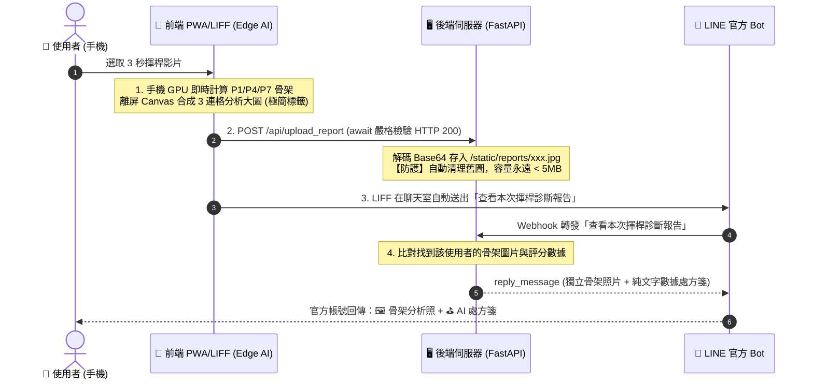

# 🏌️ GOLF SWING AI - 開發歷程與對話決策紀錄 (DEV_LOG)

> **建立時間**：2026-09-05  
> **專案名稱**：Golf Swing AI Assistant (高爾夫智慧揮桿分析助理)  
> **技術架構**：純前端邊緣運算 (Edge AI PWA / LIFF) + 極輕量 FastAPI LINE Bot

---

## 📌 1. 核心專案設定與端點

| 項目 | 設定值 / 網址 | 說明 |
| :--- | :--- | :--- |
| **LIFF ID** | `2011445978-6xeS4R70` | 綁定至 LINE Developers LIFF 應用程式 |
| **前端 PWA 網址** | `https://leonhi1025.github.io/Golf-Assistant/static/index.html` | 託管於 GitHub Pages，支援手機 GPU 本地運算 |
| **後端 Webhook 網址**| `https://golf-assistant.onrender.com` | 託管於 Render (FastAPI)，負責 Webhook 與圖片轉發 |
| **GitHub 倉庫** | `https://github.com/LeonHi1025/Golf-Assistant` | `main` 分支 |

---

## 🏛️ 2. 系統架構與關鍵決策

### 核心技術特點：
1. **0% 伺服器 AI 負載**：
   - 影片解碼、MediaPipe 姿態估計、角度計算 100% 在使用者手機 GPU（WebGL/Wasm）上運算。
   - 伺服器記憶體佔用僅約 **35 MB**，不耗費伺服器 CPU。
2. **100% 免費回覆機制 (Zero Push Quota)**：
   - 官方帳號使用 `reply_message`（搭配 `reply_token`）發送，完全不計入 LINE 官方每月 200 則的 Push 訊息上限。
3. **自動磁碟垃圾回收防護 (Disk Safeguard)**：
   - 伺服器常態只保留最新 30 張分析截圖，超過 40 張自動刪除舊檔，硬碟空間永遠鎖定在 **5 MB 以內**。
4. **手機端快取破壞策略 (Cache Busting)**：
   - 引入 `app.js?v=20260905_2` 與 Service Worker `golf-pwa-v2`，確保手機 LINE 內嵌瀏覽器隨時載入最新程式碼。

---

## 📝 3. 開發歷程與迭代紀錄

### 🔄 第一階段：架構轉型（從伺服器端重負載 ➔ 純前端 Edge AI）
- **痛點**：原本在伺服器端運行 OpenCV + MediaPipe，導致 Render/Zeabur 伺服器記憶體容易暴增（超過 512MB 限制）。
- **解法**：重構為純前端 PWA/LIFF 架構，引入 `@mediapipe/tasks-vision`，改由手機硬體晶片即時運算，後端轉型為輕量 Webhook 轉發器。

### 🔄 第二階段：報告自動化與訊息簡化
- **使用者需求**：
  1. 使用者在聊天室只發送乾淨純文字：`查看本次揮桿診斷報告`（不帶複雜參數）。
  2. 官方 Bot 自動回傳標記有骨架的分析照片。
- **解法**：
  - 前端 Canvas 合成 P1（準備）、P4（上桿頂點）、P7（擊球瞬間）3 格橫幅照片。
  - 前端使用 `await` 嚴格確保圖片上傳伺服器並獲得 `HTTP 200 OK` 後，才透過 `liff.sendMessages` 送出指令。
  - 後端 Webhook 接收到關鍵字後，同時回覆 `ImageMessage` 與 `FlexMessage`。

### 🔄 第三階段：視覺美化與版面純淨化
- **使用者需求**：
  1. 照片發送一次即可，不與處方箋卡片重複嵌入。
  2. 照片僅標註 P1、P4、P7，其餘文字與數據移至下方文字卡片，保持照片整潔。
  3. 卡片風格改為**白底黑字、深灰按鈕**，文字調整為「⛳ 動作評定」與「💡 本次建議」。
- **解法**：
  - `app.js`：簡化 3 連格截圖，移除大標題與底部橫幅，僅保留左上方半透明膠囊標籤 (`P1 準備站姿` / `P4 上桿頂點` / `P7 擊球瞬間`)。
  - `main.py`：處方箋卡片採用 `#FFFFFF` 白底、`#111111` 黑字與 `#2D3748` 深灰按鈕；新增 `/favicon.ico` 路由消除 404 報錯。

### 🔄 第四階段：自訂對話關鍵字與伺服器喚醒機制
- **使用者需求**：
  1. 輸入 `Hi! Wake up!` ➔ 伺服器已啟動時回覆：`Hi! 現在可以點Let’s Analyze來嘗試功能！`
  2. 輸入 `Amba` ➔ 彩蛋回覆：`oh..Shit...`
  3. 輸入 `查看本次揮桿診斷報告` ➔ 回傳骨架截圖與處方箋。
  4. 其餘輸入 ➔ 統一回覆：`可以嘗試Let’s Analyze進行高爾夫球姿勢影片分析哦`
- **解法**：
  - 在 `main.py` 的 `handle_text` 實作多分支條件邏輯與正規化處理。

### 🔄 第五階段：網頁白灰高雅色系、動態大灰球背景與文案微調
- **使用者需求**：
  1. 網頁文本修改：
     - 副標題：`影片自動擷取 P1 / P4 / P7 骨架與評分`
     - 提示語：`Tips:影片於6秒者為佳`
  2. 網頁色彩與動態調整：
     - 背景採用高雅**白偏灰質感底色**（`#F4F5F7`），搭配現代純白磨砂卡片（`rgba(255, 255, 255, 0.95)`）與深色對比文字/按鈕（`#09090B`）。
     - 背景動態粒子升級：**球球變大**（半徑 3.5px ~ 9px）、**運動速度加快**（`v = 1.8x`）、**密度減半**更加簡約耐看，並帶有細膩的灰調微光動態連線特效。
     - 上傳區域圖示替換為極簡幾何 **SVG 上傳符號**，視覺風格更俐落統一。
- **解法**：
  - 更新 `static/index.html` 樣式、Meta 標籤與 Canvas 動畫繪製邏輯。
  - 更新腳本引用版本號避免快取。

---

## 🔒 4. 開發約定與團隊規範

1. **Git 推送原則**：
   - 嚴格遵守「**使用者親自 push 或明確下達 `push` 指令時才執行 `git push`**」的原則。
2. **免費用量維持**：
   - 所有 LINE Bot 回覆嚴格使用 `reply_message`，不得使用 `push_message`，確保零維運成本。
3. **文檔同步**：
   - 本文檔隨功能演進即時更新。

